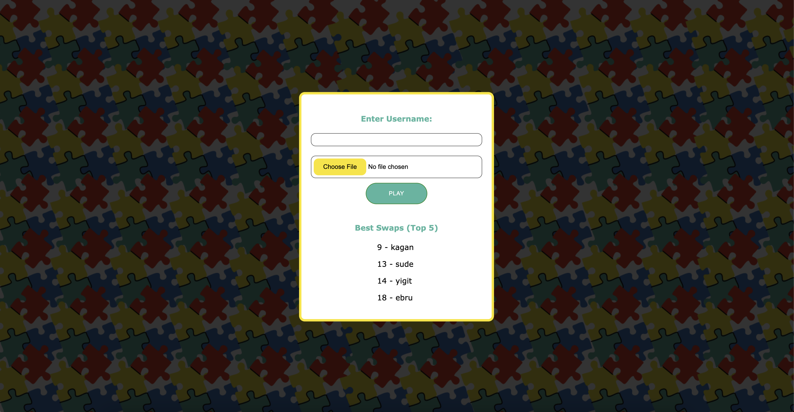
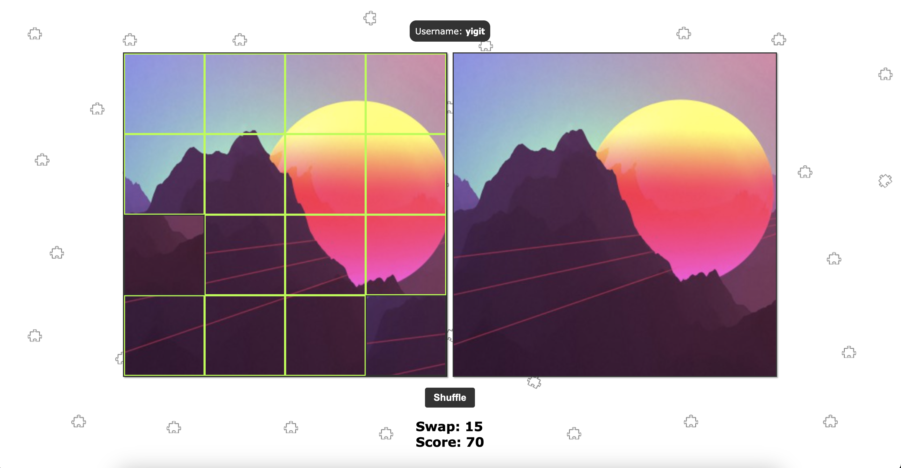

# Puzzle Game
## 16 Parçadan Oluşan 4x4 Puzzle Oyunu

> Bu proje, 16 parçalı bir kare puzzle oyununun geliştirilmesi üzerine hazırlanmıştır. Proje, bir dosyadan fotoğraf yükleme ve kullanıcı girişi özelliklerine sahiptir. Ayrıca, kullanıcılara karıştırma butonu, hamle sayma, doğru yeri geldiğinde konumu kitleme, score sayma ve bunları bir txt dosyasına yazdırma imkanı sunmaktadır. Bu projenin amacı, parçaların doğru konumunu belirlerken id veya koordinat özelliklerini kullanmak yerine bağlı liste veri yapısını kullanmaktır.

[Puzzle Oyununu Oynamak için Tıkla](https://puzzlegame-5d75e.web.app)

- Bu projeyi çalıştırmak için izleyeceğiniz adımlar:
1. Projeyi klonlayın veya kendi bilgisayarınıza indirin.
2. Firebase için gerekli bilgileri kendi firebase özelliklerine göre değiştirin. (src/index.html içindeki script tagleri içinde olan firebaseConfig)
3. src/index.html dosyasını çalıştırın.
4. Hepsi bu kadar! İyi eğlenceler..!

